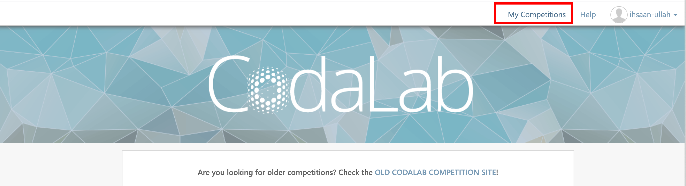
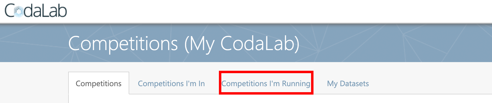
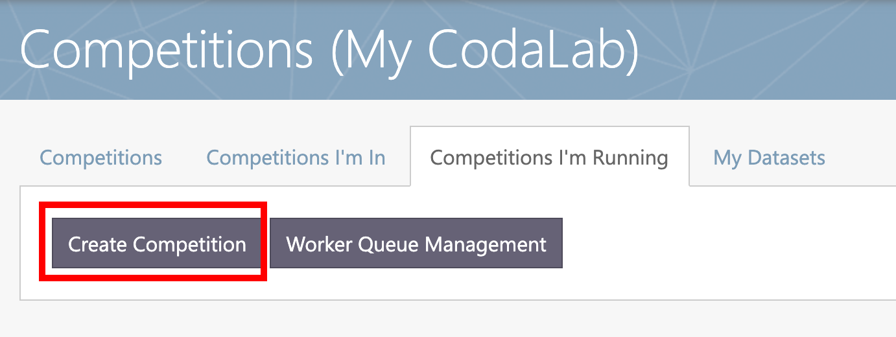
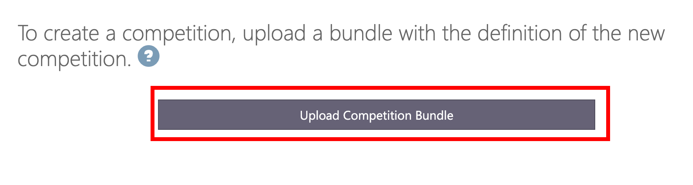
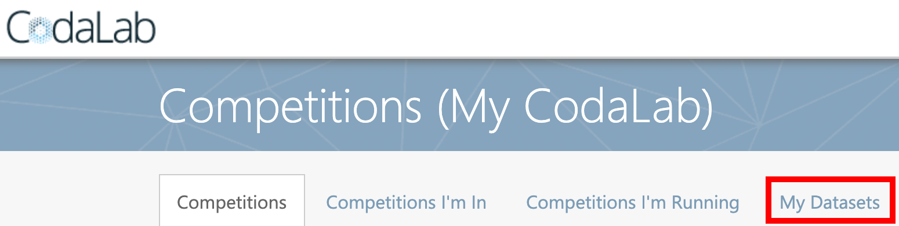
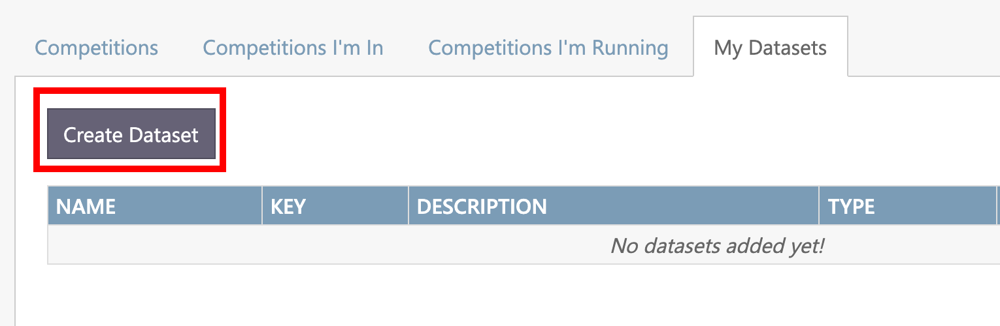
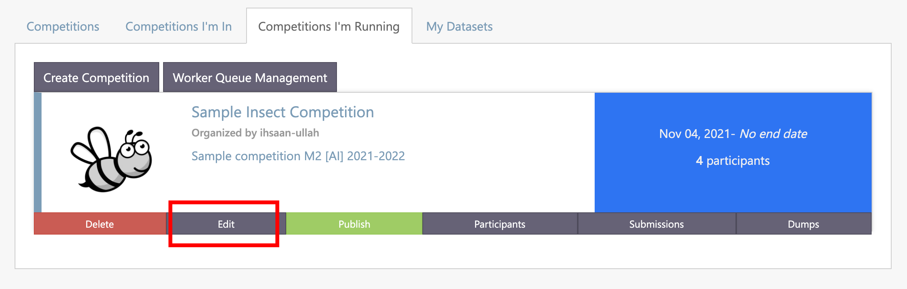

# Repository for Codalab bundle for AI Challenge Creation Class

This repository is for **challenge organizers** to organize a challenge on [Codalab](https://codalab.lisn.upsaclay.fr/).

This repository has a sample `starting_kit` which is made specially to work with this [Data Format](https://github.com/ihsaan-ullah/meta-album/tree/master/DataFormat).

A sample challenge with the `starting_kit` in this repository is given here: [Sample Challenge](https://codalab.lisn.upsaclay.fr/competitions/201).


***

<br><br><br>


# Table of Contents
1. [Understanding the Starting Kit](#understanding_the_starting_kit)
2. [Instructions about datasets](#instructions_about_datasets) 
3. [How to create a challenge on Codalab?](#how_to_create_a_challenge_on_codalab) 
4. [How to upload datasets on Codalab?](#how_to_upload_datasets_on_Codalab) 
5. [How to change datasets in a competition?](#how_to_change_datasets_in_a_competition) 
6. [Docker](#docker) 


***

<br><br><br>


# Understanding the Starting Kit <a name="understanding_the_starting_kit"></a>

The starting kit consists of the following directories and files:

1. `html_pages`  
A directory which contains  these html files for Codalab webpage of the competition: 
    - `overview.html` : to give an overview of the challenge, description of task and credits
    - `data.html` : to describe the data to be used in this challenge
    - `evaluation.html` : details about how participants will be evaluated  
    - `rules.html` :  Terms and Conditions for participating in this challenge
    
You have to change all the html files according to your competition details except `rules.html`.


2. `ingestion_program`  
This directory consists of the following files:
    - `data_io.py` : contains functions to load the data
    - `ingestion.py` : responsible for loading, running the model with the input data and to save the results in the results directory
    - `metadata` : a file required to run the code on Codalab 


3. `scoring_program`  
This directory consists of the following files:
    - `metric.txt` : a text file which consists of the name of the metric of evaluation
    - `solution.py` : to load only the solutions from the input data
    - `score.py` : responsible to compute score from the predictions made by `ingestion.py` and ground truths from `solution.py`
    - `libscores.py` : consists of pre-defined metrics 
    - `my_metric.py`: a file in which you can define your own custom metric or use any metric from a library e.g. scikit-learn
    - `metadata` : a file required to run the code on Codalab 


4. `scoring_output`  
This directory consists of `scores.html` and `scores.txt` files. These files are used to store scores from scoring program and to load scores to the leader board


5. `sample_data`  
This directory contains the sample data (a subset of *Dataset 0*) for the challenge. The dataset should be in this [Data Format](https://github.com/ihsaan-ullah/meta-album/tree/master/DataFormat).


6. `sample_code_submission`  
This directory consists of `model.py` file which has a Model Class with different functions. You have to change this file but the names of the functions should be the same. You can also keep a pre-trained model in this directory which could be used as a pre-trained model when you submit a code submission.


7. `sample_result_submission`  
This directory contains `train.predict` and `test.predict` files which are used to calculate the score. 


8. `utilities`  
This is an important directory which contains `make_bundle.py` to make a bundle to be uploaded as a competition on Codalab. To run this script, use the following command:
```python make_bundle.py```

9. `logo.jpg`  
This image is the logo for your competition on Codalab website.

10. `README.ipynb`  
This is python notebook which gives the participants a tour from data loading to code submission on Codalab.

11. `README.MD`  
A readme file for an overview of the challenge


***

<br><br><br>

# Instructions about datasets <a name="instructions_about_datasets"></a>

The challenge consists of two phases:  
- `Data Phase 1`  
- `Data Phase 2`


This challenge is designed for a triplet of datasets:  
- `Dataset 0` (to be used as `public_data`)
- `Dataset 1` (to be used in `Data Phase 1`)
- `Dataset 2` (be used in `Data Phase 2`)


***

<br><br><br>

# How to create a challenge on Codalab? <a name="how_to_create_a_challenge_on_codalab"></a>

Follow the steps below to create a challenge on [Codalab](https://codalab.lisn.upsaclay.fr/).  


### Step 0 : Clone this repository


``` 
git clone https://github.com/ihsaan-ullah/create_a_challenge.git
```


### Step 1 : Create Competition Bundle

1. go to `utilities` directory in the starting_kit
``` 
cd create_a_challenge/starting_kit/utilities
```

2. Run the script `make_bundle.py`
``` 
python make_bundle.py
```
This script will create a zip bundle which you can upload to Codalab.

### Step 2 : Upload Bundle

1. Create an account on the Codalab Website: https://codalab.lisn.upsaclay.fr/accounts/signup/

2. Login into your account : https://codalab.lisn.upsaclay.fr/accounts/login/

3. Click `My Competitions` in the top navigation bar


4. Click `Competitions I'm Running`


5. Click `Create Competition` 


5. Click `Upload Competition Bundle` and upload the bundle created in ***Step 1***



##### ⚠️ Note  
You have to make changes according to the specifications and goals of your challenge before uploading it to Codalab.

***

<br><br><br>


# How to upload datasets on Codalab? <a name="how_to_upload_datasets_on_Codalab"></a>

Follow the steps below to upload Public Data (`Dataset 0`) and Input/Reference Data (`Dataset 1` and `Dataset 2`) to Codalab 

1. Click `My Competitions` in the top navigation bar


2. Click `My Datasets`


3. Click `Create Dataset`


4. Enter details of the dataset:
    - Name of dataset
    - Description of dataset
    - Select type
    - Select the zipped dataset and click upload


##### ⚠️ Note  
- For Public Data (`Dataset 0`) choose the type *Public Data*
- For Input Data (`Dataset 1`, `Dataset 2`) choose *Input Data*
- Choose other types for `scoring_program`, `ingestion_program` or `starting_kit`.


***

<br><br><br>


# How to change datasets in a competition? <a name="how_to_change_datasets_in_a_competition"></a>

Follow the steps below to change datasets in your competition.

1. Click `My Competitions` in the top navigation bar


2. Click `Competitions I'm Running`


3. Click `Edit Competition`


4. Scroll down to the section `Phases`. 

5. For ***Phase 1*** select the correct *Public Data* and *Input Data* from the dropdown menu  
    - Public Data : `Dataset 0`  
    - Input Data : `Dataset 1`

6. For ***Phase 2*** select only the relevant *Input Data* from the dropdown menu  
    - Input Data : `Dataset 2`

7. Click the `Submit` button at the bottom of the page to save changes.


***

<br><br><br>


# Docker <a name="docker"></a>

On Codalab, this docker image is being used to run the challenge code
`ihsaanullah/codalab-legacy:gpu`

You can clone this docker image and change it as per your challenge (installing required packages) and then use it in your challenge.

## How to Clone Docker Image?

1. Install docker desktop app  
https://www.docker.com/products/docker-desktop

2. Pull the docker image
```
docker pull ihsaanullah/codalab-legacy:gpu
```

## How to test the Docker Image?
⚠️ The following commands are for linux.

1. Zip your `starting_kit` (just the files inside the directory and not the directory itself)

2. Create a temporary directory
```
mkdir ~/temp_dir
```

3. Copy the zip to this directory
```
cp starting_kit.zip ~/temp_dir
```

4. Run the docker and map the temp_dir to make it visible inside the docker
```
docker run -it -v ~/temp_dir:/home/temp_dir ihsaanullah/codalab-legacy:gpu
```

This will get you inside the docker container running the docker image and the promp will look like:  

``` 
root@c74a8b1ccaf7:/#
```

5. Go to `/home/temp_dir` and rund the starting kit *ingestion program* and *scoring program*. 

```
cd /home/temp_dir
unzip starting_kit.zip
cd starting_kit
```

Run ingestion program
```
python3 ingestion_program/ingestion.py sample_data sample_result_submission ingestion_program sample_code_submission
```

Run scoring program
```
python3 scoring_program/score.py sample_data sample_result_submission scoring_output
```

Exit the docker container
```
exit
```

#### ⚠️ Note:
If you get an error for any package, you can install it using pip. When you exit the container, the packages you have installed are lost.


## How to create a docker image with installed packages?
In order to create your docker image, install additional packeges in it and to use it in your challenge:

1. Create container from the docker image and access in interactive mode
```
docker run -it ihsaanullah/codalab-legacy:gpu
```

2. Modify container as desired (install the required packages)

3. Exit the container
```
exit
```

4. List launched containers and copy the ID of the container you have just modified
```
docker ps -a
```

5. Save to a new image
```
docker commit CONTAINER_ID NEW_IMAGE_NAME
```

6. Create a Public repository on docker-hub  

7. Add a tag to the local image
```
docker tag <existing-image> <hub-user>/<repo-name>[:<tag>]
```

8. Push the image to your docker-hub
```
docker push <hub-user>/<repo-name>:<tag>
```


#### ⚠️ Note:
For Steps 6-8, follow the instructions here: https://docs.docker.com/docker-hub/repos/

***

<br><br><br>


# ⚠️ Note
1. The data should be in this format: [Data Format](https://github.com/ihsaan-ullah/meta-album/tree/master/DataFormat)  
You can ignore the *SUPER_CATEGORIES* in the data format for this competition. Check the `sample_data` provided in this [Starting Kit](starting_kit/) for reference.

2. Make sure that the `sample_data` directory has a very small subset of `Dataset 0`.

3. Make sure to zip the contents of a directory and not the directory itself when uploading the *Input Data* or *Public Data*


***

<br><br><br>


## Contact 
In case of any confusion, contact by email : ihsan2131@gmail.com


